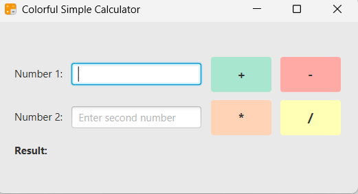

# 🧮 JavaFX Calculator App

<div align="center">


[](https://opensource.org/licenses/MIT)
[](https://www.oracle.com/java/)

</div>

## 📖 About The Project

A beautiful and modern calculator application built using JavaFX 21 and Java 24. This project demonstrates a clean UI, basic arithmetic operations, and custom icon support.

<p align="center">

>>>>>>> f162d05 (Update README: add calc-icon and output-pic screenshots)
</p>
  

## ✨ Features

- **Basic Operations** – Addition, subtraction, multiplication, division
- **Responsive UI** – Clean, modern, and intuitive interface
- **Custom Icon** – Application icon included
- **JavaFX 21** – Built with the latest JavaFX
- **Java 24** – Compatible with Java 24 and above

## 🚀 Getting Started

### Prerequisites

- Java Development Kit (JDK) 24 or higher
- JavaFX 21 SDK ([Download JavaFX](https://gluonhq.com/products/javafx/))
- (Optional) JavaFX Scene Builder for UI prototyping

### Installation

1. **Clone the repository**

   ```sh
   git clone https://github.com/AbdulRaffayQureshi/CalculatorApp.git
   cd CalculatorApp
   ```

2. **Download JavaFX 21**

   - Download from [GluonHQ JavaFX](https://gluonhq.com/products/javafx/)
   - Extract and note the path to the `lib` directory

3. **Compile and Run**

   ```sh
   javac --module-path /path/to/javafx-sdk-21/lib --add-modules javafx.controls,javafx.fxml -d out src/*.java
   java --module-path /path/to/javafx-sdk-21/lib --add-modules javafx.controls,javafx.fxml -cp out Main
   ```

   Replace `/path/to/javafx-sdk-21/lib` with your actual JavaFX SDK path.

4. **Icon**
   - The app uses a custom icon at `assets/icon.png`. Replace it with your own if desired.

## 🖼️ Final Output

<p align="center">
  
</p>

## 🧱 Project Structure

```
CalculatorApp/
├── src/                # Java source files
├── assets/             # Icons and screenshots
│   ├── icon.png
│   ├── screenshot.png
│   └── final-output.png
├── out/                # Compiled classes
├── README.md
└── ...
```

## 🛠️ Technical Details

- **UI**: JavaFX 21 (no Scene Builder used)
- **Java Version**: 24
- **Icon**: PNG format, set via JavaFX API
- **No external dependencies** beyond JavaFX

## 📝 License

This project is licensed under the MIT License - see the [LICENSE](LICENSE) file for details.

---

<div align="center">
  Created with ❤️ by [Abdul Raffay Qureshi](https://github.com/AbdulRaffayQureshi)
</div>
